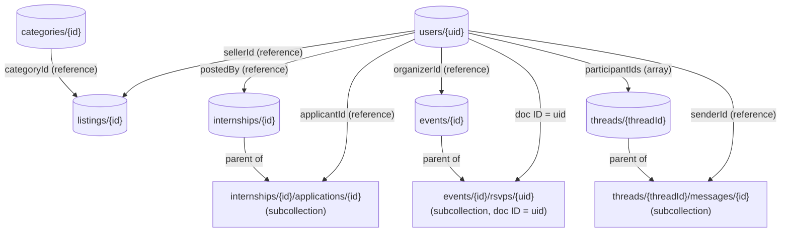

# CampusConnect — Data Model (Firestore)

## Why this isn't a traditional ER diagram

An ER diagram documents tables, foreign keys, and joins — that's a
relational-database concept. Firestore has none of those: it's a
**NoSQL document database** organized as collections of documents,
which can contain nested subcollections. There are no foreign key
constraints enforced by the database itself, and there's no JOIN — if
you need related data, you either **embed** it, **reference** it by ID
and fetch separately, or **denormalize** (copy a small amount of data
onto both sides so you don't have to fetch twice).

This document is the Firestore equivalent: it shows every
collection, what documents look like inside it, and how collections
relate to each other — the same *purpose* as an ER diagram, adapted to
how this database actually works.

## Collection map

## Design choices worth explaining in the presentation

**Subcollections instead of a foreign-key column, where the
relationship is "owned" by the parent.** `applications` live *inside*
each internship document (`internships/{id}/applications/{id}`) rather
than as a flat top-level collection with an `internshipId` field. Same
for `rsvps` inside `events`. This means "get all applications for this
internship" or "get all RSVPs for this event" is a direct, cheap query
with no filtering needed — the structure itself expresses the
relationship.

**RSVP document ID = the user's UID, not an auto-generated ID.** This
is a genuine Firestore pattern worth highlighting: it makes "has this
user already RSVP'd" a single, free existence-check
(`events/{id}/rsvps/{uid}`) instead of a query, and it makes
double-RSVPing structurally impossible — writing to the same document
ID twice just overwrites it, it can't create a duplicate. This is the
NoSQL-native way of doing what a `UNIQUE` constraint does in SQL.

**Messages live under `threads`, not directly under `listings`.** A
thread is the (listing, two participants) conversation — its ID is a
deterministic string built from those three pieces
(`{listingId}_{sorted uid pair}`), so opening "the same" conversation
always resolves to the same document instead of creating duplicates.
`participantIds` is stored as an array on the thread so a security rule
can check "is the requesting user part of this thread" without an
extra lookup.

**References, not embedding, for anything that changes independently.**
A listing stores `sellerId` (a string reference to a `users` document),
not the seller's name/phone copied inline — so if a user updates their
name, every listing they've ever posted doesn't need to be rewritten.
The tradeoff: reading a listing card with the seller's name requires a
second read (or a small denormalized `sellerName` field kept in sync at
write time — see `TECHNICAL_DOCUMENTATION.md` for that tradeoff
discussion).

## What Firebase Authentication owns vs. what Firestore owns

`users/{uid}` documents do **not** store a password or a verification
token — Firebase Authentication is a separate service that owns
credentials, session tokens, and email verification status
(`user.emailVerified`) entirely. The Firestore `users` collection only
holds *profile* data (name, university, phone) linked by the same UID
Firebase Auth assigns. See `TECHNICAL_DOCUMENTATION.md` for why this
split matters and what it removes from the rest of the system.
